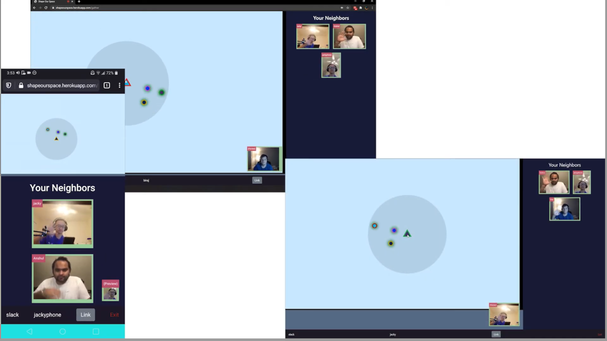

# Shape Our Space
A HackGT7 project. 

[Demo video](https://www.youtube.com/watch?v=xIP3Pz8olXU&feature=emb_title)

## Inspiration
We all have used video calling software these past few months, but they 
are better for presentations than social functions. Our project emulates 
the flow of real life social situations, allowing you to move from conversation 
to conversation as needed.

[Project link](https://shape-our-space.herokuapp.com)
[Official link does not work](shapeour.space)

## What it does
Shape Our Space is a peer-to-peer video call web application for all sorts of 
social events from birthday parties to career fairs. You control a token that 
can move around in a 2D virtual space. You can video chat with other people 
nearby you. However, if you want to move to a different conversation, you can 
easily move your token away from this group and join another group's conversation 
in a different area. And if you want to come back, you can easily walk back to 
a previous group!

You can also set up "Speaker" sections where you can broadcast your video/audio 
during a presentation but you will be distracted by the audience's video/audio. 
These spaces can be thought of as hills, the higher you are the more people you 
can speak towards. Just like speaking on a hill, while you can broadcast yourself 
outwards it is difficult to hear those below you. Since these spaces can overlap, 
it is possible to create speaker sections and private rooms inside of a single lobby.

## How I built it
HTML, CSS, and JavaScript built the front end. We used Flask for the back end, 
JavaScript and webRTC (peer.js) for the peer-to-peer communication, and EaselJS 
for the graphics. We setup Python workflows set up on GitHub. We also setup the 
continuous integration & notifications via Slack. Finally, we deployed our project 
with Heroku.

## Challenges I ran into
Properly engaging and disengaging the video calls was challenging due to browser 
incompatibilities. Being able to dynamically create video calls slowed us down since 
the public server for peerjs broke while we were using it. It was extremely hard to 
debug since in the end it wasn't our fault. We fixed this by hosting PeerJS ourselves 
on a separate server. We had difficulty deploying on google cloud via github actions 
workflow. Design was difficult since we had to create a responsive application that 
works well and looks good on multiple screen sizes.

## Accomplishments that I'm proud of

Setting up a video call platform with a dynamic number of people in a given video 
call at a time is a very cool thing to interact with, and we are proud that we were 
able to set that up!

## Stack
Webrtc, PeerJS, Flask, Heroku deployment, EaselJS, Google Cloud Platform

## What's next for Shape Our Space
As far as the general feel of Shape Our Space goes, we would like to add more visual 
customization, allow for some users to be moderators, create dynamic circle size, and 
create a more visually pleasing look and feel.

As far as the mechanics of Shape Our Space are concerned, we would have really liked to 
add widgets to the platform. Our original vision for the app had each circle space with 
configurable features such as presentation mode, whiteboard mode, queue mode, and more 
which would allow for custom types of video calls and interactions. We also wanted to be 
able to embed external apps into the app to help users communicate.

We believe these changes would make Shape Our Space a platform that we ourselves would 
use for video communication. Being able to integrate video call with a real virtual 
space with custom interactions between users would make Shape Our Space a real 
competitor in the video streaming market.
